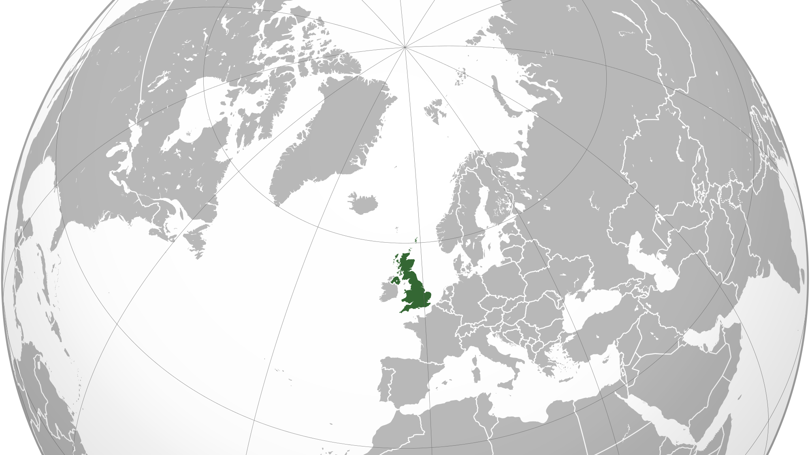

# Beginning mapping

Welcome to beginning mapping and spatial analysis for social researchers course.

## About your instructor

My name is Phil and I'm a geographer.
I have a PhD in geography from the University of Sheffield, in which I specialised in computer simulations of small--area geographical data.
I now work at the University of Derby on an ESRC--funded research project.
I use GIS and geographical methods extensively in my work.

I enjoy teaching and have taught variations of much of this material to postgraduate level.
I hope you enjoy your course and come away with the skills and confidence to produce your own maps for spatial analysis; the world needs more geographers!

## Course aims

By the end of this course you will be able to:

- obtain spatial data,
- obtain suitable thematic data,
- spatially 'join' the data,
- produce a thematic map using appropriate software,
- export your thematic map,
- analyse and interpret it and explain the relationships between areas and themes

We will cover:

- spatial data (e.g. shapefiles, GeoJSON)
- thematic data (points (e.g. business locations); aggregate (e.g. population))
- 'joining' these data
- projections and coordinate reference systems (CRS)
- identifying, understanding, and describing spatial patterns
- exporting maps for reports or publications

## Before the course starts

To produce our maps we will use QGIS, a mature, open-source GIS used extensively in academia, public organisations, and private companies.
QGIS is open source software and is free to download and use for any purpose.

So that we can get started promptly on day, before the course date it would help if you could download and install version 3 or greater of QGIS.
You can download the appropriate software for your system here: https://qgis.org/en/site/forusers/download.html

Don't worry if you have difficulty install QGIS; I can help you on the day.
