# Introduction

Welcome to beginning mapping and spatial analysis for social researchers course.
This one--day course is being run on behalf of the Social Research Association.
This course contributes 6 hours to the MRS CPD programme.

Maps are more than just navigational tools.
Almost all aspects of our lives can be mapped and analysed.
Maps of air pollution, cars per household, education, ethnicity, greenspace, religion, disease, life expectancy, even the number and location of take-away outlets can help us gain insight into the spatial nature of our world.

Maps are used to depict variables and information (themes) of relevance to social researchers.
These thematic maps are then used to understand the relationship between area and the theme of interest.


Area is important because it affects multiple aspects of our lives.
For example, baby boys born in the UK in 2012-2014 can expect to live to 79.5 years on average, but boys born in the richest part of the country can expect to live nearly a decade longer than boys born in the poorest part of the country (ONS, <https://goo.gl/s4E8Pm>).

This course will equip you with the skills you need to produce your own thematic maps, and the knowledge you need to analyse and interpret them.
The majority of the day will be practical.
At the end of the day there will be time to try mapping your own data, if you wish.


## About your instructor

My name is Phil, and I am your instructor on this course.

I have a PhD in geography from the University of Sheffield.
I specialise in computer simulations of small--area geographical data, but undertake all types of GIS and geographical analysis.

I now work at the University of Derby on an ESRC--funded research project.
For over ten years I have worked in both private and public--sector organisations as a data analyst.

I write blog posts and post tutorials about GIS on my website, which is <https://philmikejones.me>.
I enjoy teaching and have taught variations of much of this material to postgraduate level.

I hope you enjoy your course and come away with the skills and confidence to produce your own maps for spatial analysis; the world needs more geographers!

### Bio

Dr Phil Mike Jones is a geographer.
He holds a PhD in human geography from the University of Sheffield. He specialises in spatial analysis and GIS, and has written software for spatial analysis and spatial simulation.
He has extensive experience of social research, especially quantitative methods, in a variety of sectors.
Phil has taught geography, GIS, and quantitative methods to undergraduates, postgraduates, academics, and practitioners, in a variety of settings.
Phil uses open software and data in his teaching where possible to make these skills as accessible as possible.


## Course aims

By the end of this course you will be able to:

- Obtain spatial data (e.g. shapefiles, GeoJSON).
- Obtain suitable thematic data, such as points (e.g. business locations) and aggregate data (e.g. population data).
- Spatially 'join' the data.
- Understand which projection and coordinate reference systems (CRS) to use.
- Produce a thematic map using appropriate software.
- Export your thematic map for reports and publications.
- Analyse and interpret it and explain the relationships between areas and themes.


## Before the course starts

So that we can get started promptly on the day, before the course date it would help if you could download and install the software and some of the data we will be using.

You will need two pieces of software on the day.
One is QGIS, which is the GIS software that we will use to produce our maps.
The second is a spreadsheet programme to edit numerical data.
Both can be downloaded free of charge and can be used for any purpose.

You may already have Microsoft Excel installed on your computer.
If you do not you can download LibreOffice and use the Calc programme.
Either Excel or Calc will be more than adequate for our needs on the course.

You can download QGIS from:

```html
https://qgis.org/en/site/forusers/download.html
```

Be sure to download a version 3.x of QGIS.
Versions beginning 2.x (currently 2.18) are being discontinued, so it is worth starting with the current version.
I strongly recommend you download the long--term release version (currently 3.4).

You can download LibreOffice from:

```html
https://www.libreoffice.org/download/download/
```

Either version is fine, but if you are in any doubt choose the lower version number, currently 6.1.5.

Don't worry if you don't manage to install these; I can help you on the day if necessary.

<!--TODO Add link to data download zip-->


# Software

## QGIS

To produce our maps we will use QGIS, a mature, open-source GIS used extensively in academia, public organisations, and private companies.
QGIS is open source software and is free to download and use for any purpose.

I *strongly* recommend you download verion 3.x of QGIS; not version 2.x as this is being deprecated.
I also recommend you use the current long--term release (LTR), which is currently 3.4.

To open QGIS:

- On Windows press the Windows key and start typing QGIS.
- On Mac you can press Cmd + space, then start typing QGIS.
- On Linux your desktop manager will have a run shortcut (on Ubuntu it's the Super key).

If you have a choice of packages choose QGIS Desktop.
The default interface looks like Figure \ref{qgis-interface}.


The default configuration options for QGIS are quite sensible and do not need much tweaking.
I would suggest the following two changes.

### Rendering with multiple cores

QGIS should already have rendering with multiple cores enabled.
The change I suggest is specifying the maximum number of cores to the number of cores available minus 1.
This can prevent your system from temporarily locking up by always ensuring at least one core is available for tasks other than rendering.
To do this open `Settings` > `Options` menu, and click the `Rendering` tab.


Tick `Max cores to use` and enter a number.
If you do not know how many cores your computer has QGIS is pretty good at detecting this, so click up until you can no longer increase the number of cores, then simply drop one.
If in doubt, most consumer computers have four, so specify three and press `Ok`.

### Default CRS

If most of your mapping will be of the UK (England, Scotland, Wales, and Northern Ireland) it may make sense to change the default coordinate reference system (CRS).
Most sources of UK spatial data, such as Ordnance Survey or UK Data Service, use the British National Grid CRS (nothing to do with electricity) so it may be worth specifying this as the default.
Don't worry too much what this is at this stage; I will explain this in a later section.

Change the default CRS by opening the `Settings` > `Options` menu if it's not still open, and click the `CRS` tab.


By `Default CRS for new projects` click `Select CRS` (the little globe to the right).
Then type `27700` (the code for British National Grid) and select it and press ok.


You can always change the CRS for other projects if necessary.
Of course, if most of your mapping will be for a country or region other than the UK a different default CRS might make more sense!

## Spreadsheet

If you are using Microsoft Excel I will assume you are relatively familiar with it.
However, we are only using the spreadsheet programme to store and retrieve data; we are not using any advanced functionality.
The steps I demonstrate in LibreOffice Calc are therefore very similar to the steps in Microsoft Excel.

LibreOffice is a free and open source suite of office applications similar in function to Microsoft Office.
LibreOffice Calc is the spreadsheet programme.

If you are using Calc it's interface looks like Figure \ref{calc-interface}.


## Open source

Both these packages (QGIS and LibreOffice) are free software.
This means they are free to download and use for any purpose, and also that their source code is free to obtain.

This does not mean that they are inferior to their licensed counterparts (and in some ways could be considered superior).
They are both robust, professionally--written software.
It just means that instead of charging the end user a license fee their development is paid for by individuals and organisations from all over the world through sponsorship and donations.

Much of the backbone of the internet is underpinned by open source software contributed to by well--known companies like Google and Microsoft, so don't worry that 'free' means unsatisfactory.


# Obtaining spatial data

To plot a map we must first obtain some spatial data that describes the polygons and geometry of the map.
There are a number of sources of spatial data.
You can see the full list in the [References][] section.

For these exercises we will download our boundary data from:

```html
https://census.ukdataservice.ac.uk/get-data/boundary-data.aspx
```

<!-- TODO Screenshot of boundary website -->

This service offers a comprehensive range of high quality shapefiles covering a range of administrative geographies for all of the UK.

For our first map we will make a simple plot of regions in Great Britain (England, Wales, and Scotland).
England has nine regions, while Scotland and Wales are each considered a region, making 11 in total.
We will use the `Easy Download` service to download the regions of England, Scotland, and Wales individually, and we will combine these in QGIS.

<!-- TODO Why am I not using Northern Ireland? I think it uses a different projection system -->

Download and unzip the following files if you have not already downloaded the data archive:

```html
https://borders.ukdataservice.ac.uk/ukborders/easy_download/prebuilt/shape/England_gor_2011.zip
https://borders.ukdataservice.ac.uk/ukborders/easy_download/prebuilt/shape/Scotland_ol_1991.zip
https://borders.ukdataservice.ac.uk/ukborders/easy_download/prebuilt/shape/Wales_ol_2011.zip
```

I suggest you create a project folder to store these files in.
I have called mine `regions`.


## Clipped and generalised polygons

At this point it is worth making a small aside to discuss simplified polygons.
For this example I have specified exactly which file to download, but when obtaining spatial data it is common for services to offer clipped and/or generalised polygons.
These typically are simplified and as such are a smaller file size than the unmodified files.
However, from experience these often have 'slivers' or gaps between the polygons so the resulting polygons may not be valid which can be problematic for analysis.

I therefore recommend downloading the original or unmodified shapefiles.
Bandwidth and disk space are cheap; your time spent correcting topology errors is not!
If you later decide you need to simplify the polygons, for example for serving on a website for users to interact with or simply to make plotting faster, it is quite straightforward to do this and you get more dependable results.


There are many tools that are 'topologically--aware' that do not create slivers.
In QGIS if you need to perform a topologically--aware simplification, use `v.generalize` in the GRASS Toolbox (under `Processing` > `Toolbox`).
See Figure \ref{qgis-grass-v-generalize} for where to find this tool.


If you need to install GRASS you can obtain this from:

```html
https://grass.osgeo.org/download/
```

(If you're using Linux you can use your package manager to install `qgis-plugin-grass`, for example on an Ubuntu system run `sudo apt install qgis-plugin-grass`).


## Projections and Coordinate Reference Systems

To produce a map you must specify (or use the default) coordinate reference system (CRS).
A coordinate reference system specifies:

- how coordinates are assigned to points on the Earth, and
- the origin and scale of the coordinate system.

A projection describes how the three--dimensional surface of the Earth is distorted to fit a two--dimensional map, either on the screen or in print.
You can explore the size of the distortions of the Mercator projection using

```html
https://thetruesize.com
```

Fundamentally the CRS and projection specifies what the coordinates 'mean' so the they can be plotted correctly, and as a result the two terms are often used interchangeably.

The CRS and projection are often specified in the same step and in practice you will typically download a spatial data file and specify the correct CRS for that data.
Often the data you download will have a CRS/projection bundled with it and when you load the file the correct CRS will be applied.
For example, the English regions zip file contained a `.prj` file which QGIS uses to apply the correct CRS to the file as it is loaded.
You can open these `.prj` files with any text editor and the contents looks something like this:

```wkt
PROJCS["OSGB_1936_British_National_Grid",GEOGCS["GCS_OSGB 1936",DATUM["D_OSGB_1936",SPHEROID["Airy_1830",6377563.396,299.3249646]],PRIMEM["Greenwich",0],UNIT["Degree",0.017453292519943295]],PROJECTION["Transverse_Mercator"],PARAMETER["latitude_of_origin",49],PARAMETER["central_meridian",-2],PARAMETER["scale_factor",0.9996012717],PARAMETER["false_easting",400000],PARAMETER["false_northing",-100000],UNIT["Meter",1]]
```

This `.prj` specifies the British National Grid.
It uses the OSGB 1936 coordinate system, the Airy 1830 spheroid (the Earth is not a perfect sphere), and the unit is metre (i.e. each unit increase in coordinate is equivalent to one metre).

Don't worry too much about these; in practice most spatial data now specifies a CRS so this is automatic.
You only need to know about these if:

- the spatial data does not bundle a CRS and you need to specify it manually, or
- you have data sets in different CRSs and you need to *transform* or *reproject* one or more data sets to be consistent (I describe how to do this below).

If you are using UK data from sources such as the OS the CRS is almost certainly the British National Grid (27700).

The CRS is specified using a unique code called an EPSG code.
A full list of all EPSG codes can be obtained from:

```html
http://spatialreference.org/ref/epsg/
```

The EPSG codes for the two most common CRSs you will use (at least in the UK) are:

- British National Grid `27700`
- Mercator WGS84 (most common for web maps such as Google Maps) `4326`


## Opening spatial data in QGIS

From the QGIS window (Figure \ref{qgis-interface}) use the browser in the left sidebar to navigate to your project folder.
In this folder select the file(s) that you want to open (you can hold Ctrl/Cmd and click to select multiple files) then press `Add selected layers`, or drag these into the `Layers` panel.

Select the following files and add them as layers:

- `england_gor_2011.shp`
- `scotland_ol_1991.shp`
- `wales_ol_2011.shp`

Your map should look something like this:


Congratulations!
You've just produced your first map!
Notice in the bottom right corner the Current CRS is set to `EPSG:27700`, the British National Grid.


## Save your project

At this point we will save our project.
I recommend saving your project regularly, especially before making any changes to styling or formatting of your plot.
To save press the 'Save Project' icon, or use the keyboard shortcut `CTRL` + `S` (or `Cmd` + `S` on Mac).


I've saved my project as 'regions' in the `regions/` directory along with my shapefiles.
Remember to save regularly as you progress.


## Other spatial data types

So far we have used file formats called shapefiles to plot our maps.
These are probably the most common file format for storing boundary data, but they are not the only file format.
You might see other file formats including:

- GeoJSON - JSON (Javascript Object Notation) is a common format for transmitting data across the web. GeoJSON simply extends this with geograhical boundary information.
- KML is an XML--based file format originally developed for use with Google Earth.
- GPX, commonly used for sharing GPS routes.

XML (i.e. KML) is a more verbose file format than (Geo)JSON, so I recommend you download GeoJSON when given a choice.
Open these in QGIS in exactly the same way as we opened the shapefile earlier, or simply drag and drop the layer in to QGIS from your file browser.

In addition to file formats you may also see OGC data services and database formats listed, such as:

- WMS
- WCS
- WFS
- PostGIS

Instead of downloading a file to your system locally, these formats work by connecting to the database from from within QGIS and using QGIS as a browser to obtain the boundary extent you require.
Performing these steps is beyond the scope of this one--day course, but it is quite straightforward.
If you wish to explore this the following link to the QGIS documentation will get you started (documentation for version 3.x of QGIS is still a work--in--progress so this page is written for version 2.18 of QGIS which is now out of date, but the steps are largely the same):

```html
https://docs.qgis.org/2.18/en/docs/user_manual/working_with_ogc/ogc_client_support.html
```


## Modifying boundary files

For our first map we plotted all of the regions of Great Britain.
Sometimes we may want to plot a smaller area of the country.
For example, you may wish to plot just one region or local authority.

It is sometimes possible to download just the boundaries we need.
For example the Boundary Data Selector

```html
https://borders.ukdataservice.ac.uk/bds.html
```

allows us to select certain sub regions, but does not always give us enough control over which areas to select.
It is therefore often necessary to trim or modify larger boundary files.

For this next exercise we'll select just the Greater London region (I've chosen Greater London because I thought this would be the area people are most likely to be familiar with).
Untick Scotland (`scotland_ol_1991`) and Wales (`wales_ol_2011`), leaving just England (`england_gor_2011`).


### Create a backup copy

Before modifying your shapefiles in any way it is a good idea to create a backup copy first.
I recommend you get into the habit of making a backup copy before making any *destructive changes* to your input files in case you can't recover the original.

With the shapefile specification there are a number of files associated with the geometry that we need to copy, from a minimum of three to potentially more than ten (see https://en.wikipedia.org/wiki/Shapefile).
I therefore recommend saving a new copy with QGIS, which manages all the associated files automatically.
To do this simply right--click on the layer you want to copy, then select `Export` then `Save Features As`.

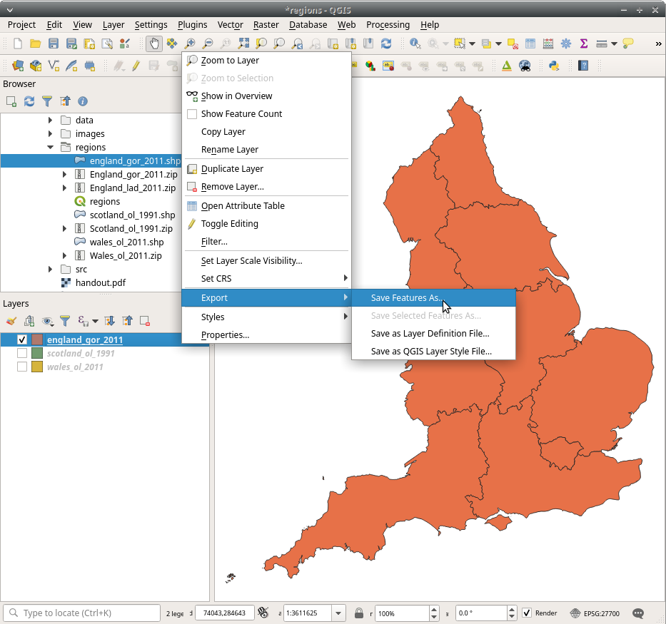

The dialogue box will give you a range of options but there are only a few we need to change:

- Under Format select `ESRI Shapefile` for now.
- Under File Name we need to specify a file name. I suggest naming our new file the same as the original, but append `_edit` to the end to remind us which layer we are editing.
- Leave the rest of the options unchanged and press `OK`.

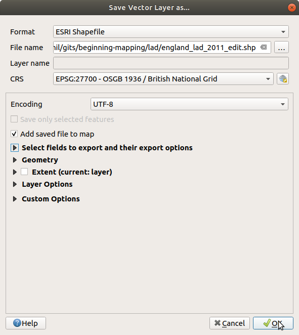

You should now have two `england_gor_2011` layers, one called `england_gor_2011_edit`.
Untick the original so we do not accidentally modify this, and we can now make changes to the copy.
Save your project (`CTRL`/`Cmd` + `S`).


## Selecting with GUI


The easiest way to select individual or groups of polygons is using the GUI (graphical user interface).
Use the 'Select Feature(s)' tool (the icon is along the top).


To select just London, click inside the London region and it should be highlighted in a particularly sharp shade of yellow.
To delete the other regions we are now going to open the attribute table (or use the keyboard shortcut `F6`):


1. Now Invert Selection (keyboard shortcut `CTRL`/`Cmd` + `R`)
1. To be able to delete (and therefore remove) these features we now need to enable editing mode (keyboard shortcut `CTRL`/`Cmd` + `E`)
1. Delete selected features (the red trashcan; there's no keyboard shortcut).
1. Save edits (`CTRL`/`Cmd` + `S`) and (optionally) toggle editing mode back off.
1. When you close the attribute table you should be left with just London.
1. Adjust the scale with 'Zoom Full' (`CTRL`/`Cmd` + `SHIFT` + `F`).


Congratulations!
You've just edited your first shapefile!


## Modify with expression

Selecting areas or regions with a GUI is sometimes straightforward and the easiest approach to take.
This approach is particularly useful if you want to select one or more regions that are adjacent to each other, or you only have a small number of regions you want to select.

When we want to select multiple regions, especially if they are not adjacent, this can be error--prone (and not to mention tedious!) if we use GUI tools to do this.
Instead for this exercise we will use 'Select by expression' which allows us to select regions by attributes, such as name or code.

As before we are going to remove a number of regions, but this time we are going to select two regions to gain experience using the expression syntax.
The expression syntax is based on `Python` and is very similar to the syntax used in SPSS to select or filter cases, so you may have already used it.

Before we begin we need to remove any existing edited files (`england_gor_2011_edit`) and make a new copy of the original file.
Click on `england_gor_2011_edit` and press 'Remove Layer/Group' (or use the keyboard shortcut `CTRL`/`Cmd` + `D`) then press OK.
Now make a copy of `england_gor_2011` as before (Export > Save Features As > Format: ESRI Shapefile; File name: `england_gor_2011_edit`).
Finally untick the original layer in the Layers panel to ensure we do not edit this by mistake.
You should be left with a copy of the `england_gor_2011` layer selected with all the regions restored.

For this exercise I am going to select London and East of England, although you are welcome to practise with any two regions you prefer.
Right--click on the layer you wish to edit (`england_gor_2011_edit`) and press Filter.
You should be presented with the Query Builder dialogue box.


Here we will select which area(s) to retain and show.
We can filter on any attribute in the file's attribute table, such as code or name, but here we will use name.

Double--click `name` to see it copied into the 'Provider specific filter expression' at the bottom.
Now press or type `=`.
Finally under 'Values' on the right press 'All' to list all unique region names.
Double--click 'London' so your filter expression should look like the following:

```python
"name" = 'London'
```

Now type or press `OR` (capitals are important), type or double--click `"name" = ` then finally double--click or type `East of England`.
Your final expression should look like:

```python
"name" = 'London' OR "name" = 'East of England'
```

Notice `name` (the field) is enclosed in double--quotes (`"name"`) and `London` and `East of England` (the values) are enclosed in single--quotes.
These distinctions are important.
Don't worry if you can't remember which way around they go; double--clicking fields or values will always add them to the expression with the correct syntax.


Press 'Test' and a dialogue box should inform you that 2 rows are selected.
Press OK to show just London and East of England.
You can resize the plot on London with the 'Zoom Full' icon (or use the keyboard shortcut `CTRL` + `SHIFT` + `F`, or `Cmd` + `SHIFT` + `F` on Mac).
You should see the following:

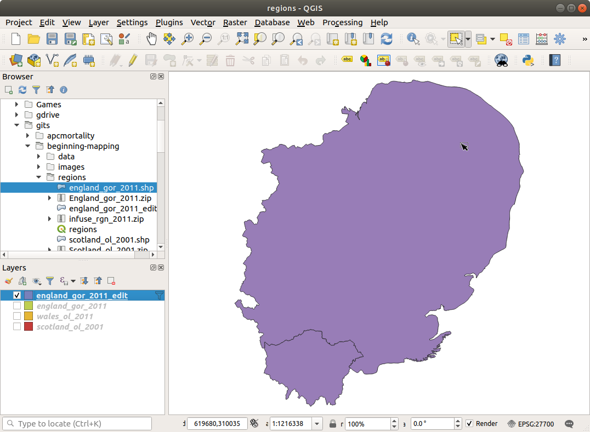

There are similar alternatives to the Query Builder:

- Select Feature by Value (`F3`)
- Select Feature by Expression (`CTRL`/`Cmd` + `F3`)

I prefer and recommend the query builder because:

- You cannot list available values with Select Feature by Value,
so you need to know in advance what your values are. For example, is it `East of England`, or `east-of-england`, or `eastOfEngland`?
- The Select Feature by Expression first selects the area(s) according to your criteria, and then you still need to remove the selection (or inverted selection) of areas; filtering does this in one step.

Sometimes you do of course want to just select areas and these tools are more appropriate, but Filter > Query Builder is often the quickest way to remove areas.

Congratulations!
This is your first programmatic modification of a shapefile!


## Modify with clip

The last approach we'll use to modify a layer is called a spatial clip.
This uses a larger polygon to specify the extent of the smaller polygons we want to keep.
For example, we might want to keep (clip) all the boroughs in the Greater London region.
We will achieve this by downloading the local authority districts (LADs) in Great Britain; these include the London Boroughs.
Next we will select just the Greater London region using the 'Select by Expression' approach above.
We will then clip the LADs layer to the Greater London region.

Download the local authority districts (LADs) file from the following URL:

```html
https://borders.ukdataservice.ac.uk/ukborders/easy_download/prebuilt/shape/England_lad_2011.zip
```

I suggest making a new project.
Start by creating a new directory (I've called mine `lad` for 'Local Authority District') and open QGIS.
Add `england_gor_2011` from the previous project (`regions`) and save a duplicate as we did in the 'Create a backup copy' section, making sure to save it into the new project ('lad').
Load `england_gor_2011_edit` (or whatever you called the copy you just made) and `England_lad_2011` into your layers panel, and you should have something that looks like this:


Select (click) on the `england_gor_2011_edit` layer.
Right--click and press 'Filter' as we did before, and enter `"name" = 'London'` in the expression.
When you `Test` this it should return 1 row.
Press 'Ok'.

This leaves us with just the London 'region', which we are now going to clip our local authorities to, saving us having to select each London Borough manually.
Under the `Vector` > `Geoprocessing Tools` menu select `Clip`:


In the dialogue box enter the following settings:

- Input layer: `england_lad_2011` (this is the layer we're going to clip)
- Overlay layer: `england_gor_2011_edit` (this is what we'll clip it to)
- Clipped: leave as temporary layer

I tend to write my clipped polygon to a temporary layer as it's easy to discard if I get it wrong (which frequently happens!); you can always save it once you've validated it (QGIS will remind you to save if you forget).
The only time it might be worth specifying a filename in advance is if you're clipping very large files.


Press 'Run'.
You should be left with 33 London Boroughs that match the London region outline.


We have used three different ways (and even combined two) to select boundaries with QGIS.
It is often the case that if you are using different layers from the same source the boundaries match and you can use clips (as we did with two layers from one source).
In the wild, especially if using layers from different sources, it is necessary to use the GUI or filter by expression tools (or a combination of both) to select the layers you need.


## Converting between projections/CRS

So far we have used layers with the same CRS (we discussed CRS in an earlier section).
If you have multiple layers from different data sources it is common that one or more layers will be in a different CRS to the others, and you must convert these to a common CRS.

One strategy is to transform one of the layers, permanently changing the coordinate system of the layer(s).
The other strategy is to reproject the layer(s) on--the--fly so the reprojection is temporary.
I find transforming is useful if I know I need to use the layer multiple times or perform analyses with it; temporarily reprojecting the layer(s) is useful for quickly exploring the layer and comparing with other sources.

Download the Greater London OSM shapefile from `geofabrik`:

```html
http://download.geofabrik.de/europe/great-britain/england/greater-london-latest-free.shp.zip
```

Unzip the file to your working directory, and add the `gis_osm_water_a_free_1` layer:


This file uses a different CRS than the London shapefile (specifically it uses WGS84 (or EPSG: `4326`)).
It is, however, projected in the same CRS as the original London layer:
Notice in the bottom right the project CRS still shows `27700`.
This has been reprojected on--the--fly to match the existing layer, so the two layers plot together correctly.
If they didn't, the Thames would not show up anywhere near London (to see what I mean open the project CRS and select 'No projection (or unknown/non--Earth projection)').
If this doesn't happen automatically (typically because you haven't selected a default CRS), click the project CRS button in the bottom right and select the project CRS you want to use.


To permanently change the CRS and coordinates of the layer we can *transform* or *reproject* the coordinates into a new CRS (more precisely we create a duplicate layer with the new CRS).
Under the `Vector` > `Data Management Tools` menu select `Reproject Layer` and select the following options:

- Input layer: `gis_osm_water_a_free_1`
- Target CRS: `EPSG: 27700 - OSGB 1936 / British National Grid` (search for 27700)


Again, I suggest creating this as a temporary layer and saving it when you've verified it (QGIS will warn you if you forget to save it).


# Thematic data

We have covered most of the fundamental tools you will need to load and prepare *spatial* data for use in a GIS.
Now it's time to bring in some thematic data to help us understand the geographical or spatial patterning of our topic of interest.
These 'thematic' data broadly fall into two categories: aggregate and point.

Aggregate data is the type of data used to produce thematic or choropleth maps and is gathered by aggregating characteristics of (usually) individuals.
Examples might include the mean life expectancy of females and/or males born today by area, the mean house price by area, or the mean weekly number of cakes consumed by area (yes, I have plotted this; it's important for dental health!).
Points are typically the locations of structures (police stations, schools, takeaways) or events (crimes) and are fairly self--explanatory.

In the next section we will look at both in turn.
Aggregate data is slightly more involved, so we will address this type of data first.


## Aggregate data

Aggregate data, as we have discussed, is usually displayed based on the aggregated information of (usually) individuals.
For example we could plot the mean life expectancy of females and/or males born today, or we could plot the total number of females and/or males in that area.
Just as when we are summarising non--spatial data, it is important to think about the most appropriate way to share our data.
It might be appropriate to plot the mean number of females in each area (instead of the total), but it would be odd to plot the total life expectancy of all females.

Both of these examples are aggregated from the individual people in that area; we could just as easily aggregate observations of other subjects.
Figure \ref{house-price-3d} shows the mean house price by local authority district (LAD).
Here the price of each property sale is the unit of observation.

Using the Boroughs (LADs) of London we clipped in the previous section we are going to produce a thematic map of
There are three stages to each aggregate thematic map:

1. Load the desired spatial data (we have done this)
1. Load the thematic data
1. 'Join' the data based on a unique key

We can then plot and style the final map.


### Load data

Begin by downloading *Life expectancy at birth and at age 65 years by local areas, UK* from ONS[^lifeexpect]:

[^lifeexpect]: http://bit.ly/2ZOzwpf

```html
https://www.ons.gov.uk/file?uri=/peoplepopulationandcommunity/healthandsocialcare/healthandlifeexpectancies/datasets/lifeexpectancyatbirthandatage65bylocalareasuk/current/leatbirthandatage65byukla201517.xls
```

For the data to load correctly in QGIS we have to tidy the data table, just as we prepare non--spatial data sets.
First, before we make any destructive changes to our data it is good practice to make a copy.
In this case we can easily download a fresh copy of the data, but I strongly suggest this is a good habit to get into for those occasions when it *is* time consuming to replace the data.
Create a copy of `leatbirthandatage65byukla201517.xls`, either in your file explorer or by opening in your spreadsheet programme and `Save As`.
Open the file and switch to the `LE at birth - Females` tab.

1. Delete the first two rows (title and blank row).
1. Delete rows `2`--`260`.
1. Delete rows `16`--`17`.
1. Delete rows `35`--`243` (the bottom of the file).
1. Delete columns `B` and `C`.
1. We do not have any data for City of London (row 3) but we need to replace the dots (`..`) with blank cells so delete these.

To load this sheet into QGIS we now have two alternatives.
We can convert the spreadsheet into a text--delimited file (such as `.csv`) or load the file in with the spreadsheet layer plugin.
We'll go through both options, but I generally recommend converting to `.csv`; it's an open, text--only format so you will always be able to open it and you can use scripts to manipulate the file in bulk if necessary.

In LibreOffice Calc or Microsoft Excel open the file and Save As, then change the format to `Text CSV (.csv)`.


Under LibreOffice Calc you can use the default options.


Finally you should receive a warning to say that only the active sheet was saved.
`.csv` files only save one worksheet at a time, so this process has saved only the active worksheet and dropped all others.
If you're working on the `LE at birth - Females` tab this is the active one, and what has been saved to your `csv` file.

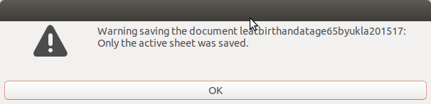

You can then load the resulting file in QGIS with the `Layer` > `Add Layer` > `Add Delimited Text Layer` menu or the `Data Source Manager` (`CTRL`/`CMD` + `L`):


From here browse to your file (if you are using Windows you will see the more familiar file path beginning with `C:`) and QGIS will automatically detect most settings.
Ensure `CSV (comma separated values)` and `No geometry (attribute only table)` are selected.
You should see a preview that looks correct.
Go ahead and press `Add` then `Close`.

If you prefer to load `xls` files directly instead we need to install a plugin to handle this.
Go to `Plugins` > `Manage and Install Plugins...` menu and search for `spreadsheet` and install the `Spreadsheet Layers` plugin:


Now open `Layer` > `Add Layer` > `Add spreadsheet layer` from the menu:


You need to provide a file path and make sure you select the correct Sheet (LE at birth - Females).
Ensure you tick `Header at first line` and `End of file detection`, and check the preview looks correct before pressing `OK`.
Whichever method you've chosen you should now see a new layer in your Layers panel listing the table.

Before we join this to our spatial data it is advisable to perform a last check on the data to ensure it has been imported correctly and deal with any edge cases.
Click on the `leatbirthandatage65byukla201517.csv` layer and open the attribute table (`F6`, or `Layer` > `Open Attribute Table` menu item).
You should see something like the following:

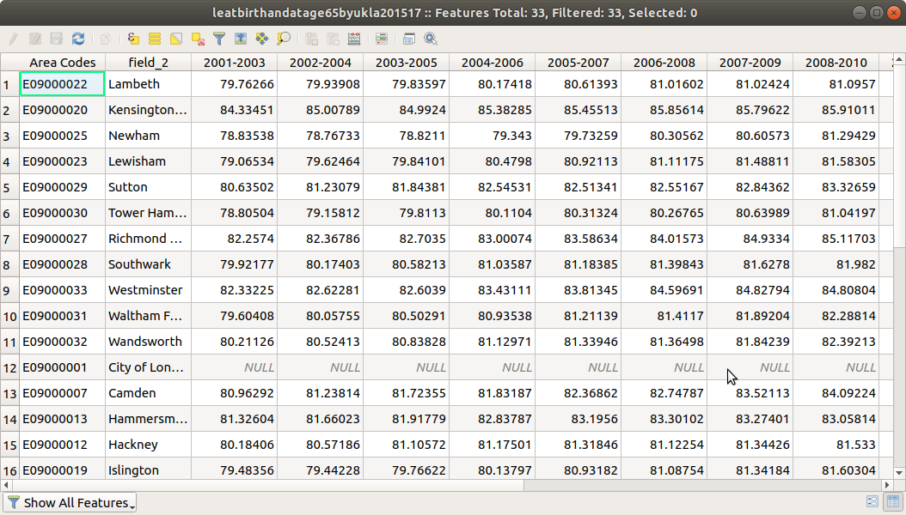

Notice that row 12 (City of London) has *`NULL`* for each year.
This is genuinely missing data from the original spreadsheet and is not an import error, and we will deal with this shortly.
For now we can move on to join the thematic data to the spatial data.


### Join to spatial data

So that QGIS (or indeed any GIS software) knows which row in this table corresponds to each zone we must join the data.
We typically join with a zone or geometry code which is unique and unambiguous, just like we would use an id to join records across database tables.
Sometimes, though, your data may only contain names which do not always match precisely (regions are the worst offenders for this; is it 'Yorkshire and The Humber' or 'Yorkshire and the Humber'? It's the former, but I've seen both.)
To do any join it is your job to ensure the zone identifier in your geometry file match the zone identifier in your thematic data.
For this example we will use a unique area code.

Begin by highlighting (single--click) the spatial layer.
Right--click the layer and press `Properties` and select the `Joins` tab.
Press `Add` (the green `+`) then:

1. Select the `Join layer` (this is the table layer)
1. Select the `Join field` (this is the id column in the table layer)
1. Select the `Target field` (this is the id column in the geometry layer)
1. If you know you only need specific columns tick `Joined Fields` and click the arrow to display a list of columns and select only those you need. We only need `2015-2017` so tick this.
1. Leave all other options as their default
1. Press `OK` then `OK` again.

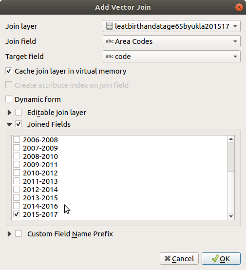

Now we are going to deal with the missing data.
Begin by right--clicking the spatial layer and select `Filter`.
QGIS will prompt you to create a virtual layer.
Select `Yes`.
It is at this stage that QGIS creates a duplicate layer with the same name as the original layer with '`(virtual)`' appended.
In the `Query Builder` dialogue box enter the following expression by double--clicking/typing as necessary:

```python
"leatbirthandatage65byukla201517_2015-2017" not null
```

When you test this 32 rows should remain.
Press `OK`.
Rename the layer with '`(virtual)`' appended to '`Life expectancy`'.
Rename the original layer (i.e. without '`(virtual)`' appended) '`Missing`', which will remind us which layer is which and will serve as the default legend titles when we come to export our map later.
Now we can begin styling our map.

If you wish to change the style of the 'missing' layer right--click on it and press `Properties` and select the `Symbology` tab.
Leave this as `Single Symbol` and choose an appropriate fill colour; grey is common for missing data.
If this layer does not show don't forget to tick it in the layers panel to activate it.

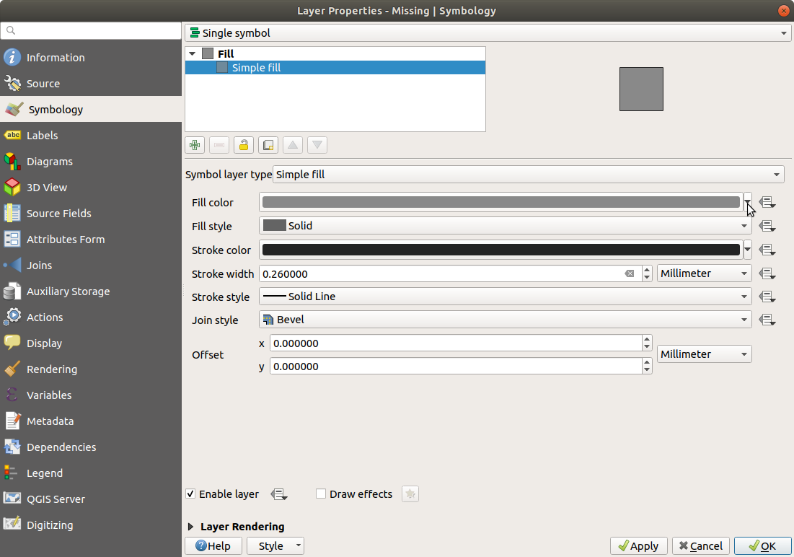

Now style the `Life expectancy` layer, again by right--clicking, selecting `Properties`, and the `Symbology` tab.
Select the following options:

- Graduated
- Column: `leatbirthandatage65byukla201517_2015\-2017`
- Colour ramp: `Blues`
- Mode: `Natural Breaks (Jenks)`
- Press `OK`.

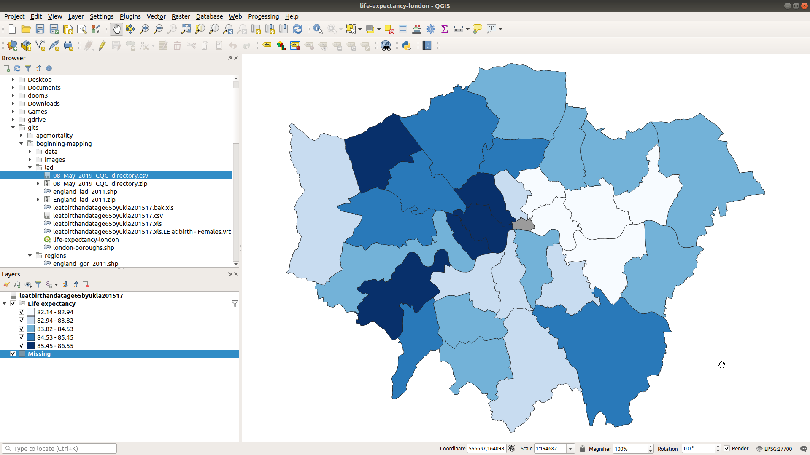

The resulting thematic map shows life expectancy at birth for females for all London Boroughs (except City of London).
If your map is uniform and just shows the colour for missing check the order of the layers in the Layers panel; `Life expectancy` should be above `Missing` to ensure it renders on top of the missing values.

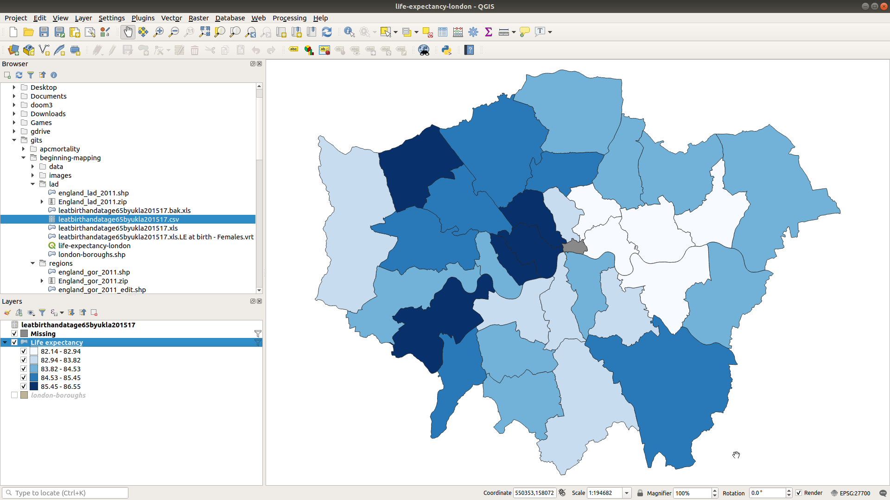

Use the `Identify Features` (`CTRL`/`CMD` + `Shift` + `I`) tool to find the names of the boroughs.
The highest life expectancies are in: Harrow; Camden; Westminster, Kensington and Chelsea; and Richmond upon Thames.
The lowest life expectancies are in: Hackney; Tower Hamlets; Newham; Greenwich; and Barking and Dagenham, all on the east side of London.
We'll get into analysis later, but if you're at all familiar with London you will no doubt notice a pattern to these.

Congratulations on producing your first thematic map!


## Breaks

When mapping life expectancy above I simply instructed you to use `Natural Breaks (Jenks)`, but choosing (and styling) breaks is so important that I want to spend some time discussing this properly now.
Just as when we are presenting non--spatial data it is essential to think about how we present that data, particularly when we group data into categories (or 'cut' it) which is typically necessary when presenting spatial data[^alternatives-to-cut].

[^alternatives-to-cut]: There are alternatives to cutting or grouping the data, including using a smooth continuous gradient and plotting a 3D image and using the z--axis to denote the theme, but cutting the data is the most common approach and the one we will use here.

The options when classifying data are:

- `Equal interval` produce intervals that are equally spaced, useful for ranked data such as percentiles (deciles, quintiles, etc.
- `Quantile (Equal Count)` splits the data so that there are an equal number of cases in each interval, creates ranked data.
- `Natural Breaks (Jenks)` splits the data statistically to maximise the difference between groups and minimise the difference within groups. Usually a good starting point.
- `Standard Deviation`, useful for seeing how much values deviate below or above the mean. Income is a common example.
- `Pretty Breaks`, generally not recommended.
- `Manual`, for greatest control.

The `Histogram` tab can be used to create and tweak manual breaks in the data.
Begin by pressing `Load Values` and select the number of bins you would like, and add the mean and standard deviation if you would life.
You can then drag and reposition the thresholds to fit your requirements.

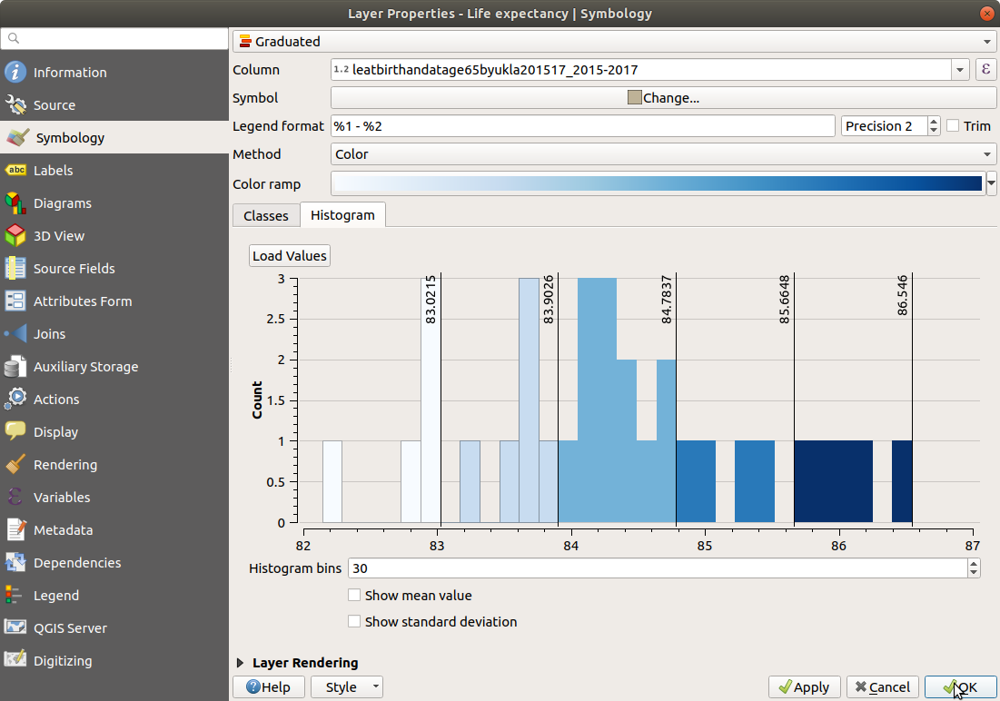

`GIS Geography` offer an accessible article discussing the uses of the different classification methods:

```html
https://gisgeography.com/choropleth-maps-data-classification/
```


## Colours

Colour is one of the main ways you will denote thematic aggregate data on a choropleth map (height, or `z`--index being the other main option).
QGIS has lots of colour palettes, and an absolutely fantastic resource if you need more palettes is:

```html
http://colorbrewer2.org/
```

When choosing colours there are three types of data and they require a different treatment of colour palette:

- Increase/decrease in values - use a sequential palette (such as we used for life expectancy above)
- Indicating either side of a divide (e.g. above or below median income) - use a diverging palette
- Labelling - if the colour will not denote data but will otherwise label the point use a qualitative palette (for example names of areas)

Avoid using red and green in the same map or viewers with red--green colour blindness will struggle to differentiate colours[^deuteranopia].

[^deuteranopia]: https://www.color-blindness.com/deuteranopia-red-green-color-blindness/


## Point data

Having looked at aggregate data and produced a choropleth map, we are now going to add some point data.
Download the Care Quality Commission (CQC) care directory and unzip it:

```html
https://www.cqc.org.uk/sites/default/files/08_May_2019_CQC_directory.zip
```

This link is regularly updated so if this link does not work manually download the file `CQC care directory - zip` from:

```html
https://www.cqc.org.uk/about-us/transparency/using-cqc-data
```

This is a file that lists every place in England that is regulated by the CQC, including GP practices, hospitals, care homes, and dentists.
We are going to plot the location of GP practices in London on top of our existing life expectancy map.
Each place in this file has a postcode provided which we are going to convert to coordinates in a process called *geocoding*.

First open the file in your chosen spreadsheet programme[^no-copy].
The file is comma delimited so ensure you use commas to separate fields when importing, and import data from row 5 to strip the header information.

[^no-copy]: Note I have not first made a copy despite my earlier recommendations to do this before making destructive changes to a file.
This is because we have the `zip` archive so if we make a mistake we can delete the file we're working on and simply extract the `zip` again.

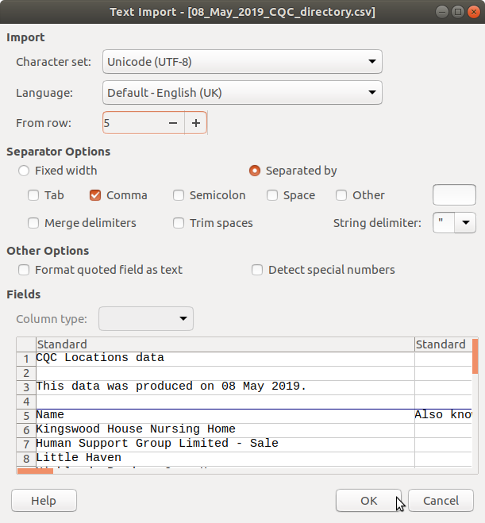

Once you have the file imported we are going to delete rows we do not need to plot.
Geocoding is an expensive operation (both in terms of time and, often, money if you need to pay for access to a geocoding service).
Note the row numbers are approximate; the CQC data is updated regularly so the file you download may differ from the one I am demonstrating here.

1. Sort the data on the `Service types` column (column G).
1. Delete rows 2--13358 (Ambulances to Diagnosis/screening).
1. Delete rows 8628--36115 (the end of the file).
1. You should be left only with GP surgeries.

We can filter this file further by removing practices outside the London area since we will not plot these.

1. Sort the data on the `Region` column (column L).
1. Delete rows 2--1431 (East to East Midlands).
1. Delete rows 1900-- to the end of the file.

You should be left with GP surgeries in London only (of which there are about 1898).
We can also tidy up the columns to make managing the data easier.
Optionally delete:

1. B: Also known as
1. E: Phone number
1. F: Service's website
1. G: Service types
1. H: Date of latest check
1. I: Specialisms/services
1. J: Provider name
1. L: Region
1. M: Location URL
1. N: CQC Location
1. O: CQC Provider ID

We are going to use the UK Grid Reference Finder postcode batch converter tool because it is free to use and presents the returned data in the easiest format.
If you are going to GeoCode postcodes often you may wish to look into using an API such as that provided by:

```html
https://postcodes.io/
```

Select all the postcodes (use `CTRL` + `SHIFT` + arrow keys to select the column quickly) and copy these (`CTRL`/`CMD` + `C`).
Open a web browser and navigate to:

```html
https://gridreferencefinder.com/postcodeBatchConverter/
```

Under Step One paste your postcodes into the box (`CTRL`/`CMD` + `V`) and press `Convert Postcodes`.
You can then select and copy the completed geocoded postcodes in `Step Three` which you can paste straight back into your spreadsheet, appending to the end columns.
Save and close your spreadsheet.

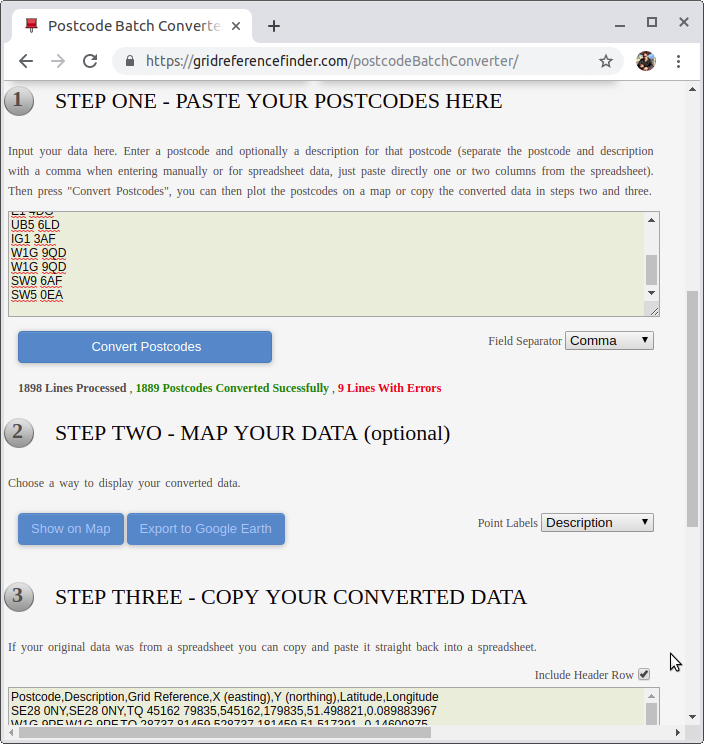

To load this data into QGIS open the Data Source Manager and select the 'Delimited Text' tab.
Click the `...` button to select the file and choose the following options:

- CSV (comma separated values)
- Tick 'First record has field names'
- Under Geometry Definition select `Point coordinates` and choose `X (easting)` and `Y (northing)` for X field and Y field respectively.
- Geometry CRS: choose the Project CRS (`EPSG: 27700 - OSGB 1936 British National Grid`)

Check the preview and when you're satisfied press `Add`.
The points should be automatically added to the plot.
If they are not visible check that they are the top layer in the Layers panel so they are rendered on top of the background layers.

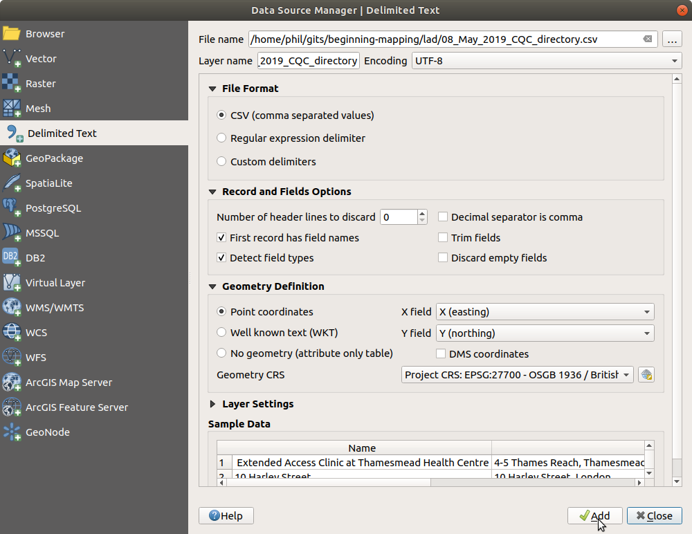

We are going to replace the default symbol with the Staff Of Aesculapius to denote a medical provider.
To style the points right--click on the points layer in the Layers panel, press `Properties` and select the `Symbology` tab.

1. Select `Simple marker`
1. Change the Symbol layer type to `SVG marker`
1. Under `SVG Groups` at the bottom select `health` and choose your preferred icon.
1. You may also wish to increase the size from `2.0mm` to about `4.0mm`.
1. Press `OK`.

A cursory comparison between the wealthy and deprived areas of London (with high and low life expectancy respectively) looks like there is a greater density of GP surgeries in wealthier areas.
It is even possible to see Harley Street in the Westminster borough.
We could (and should) test this formally as it might only be related to population, but for now it's an interesting hypothesis made possible by spatial data.

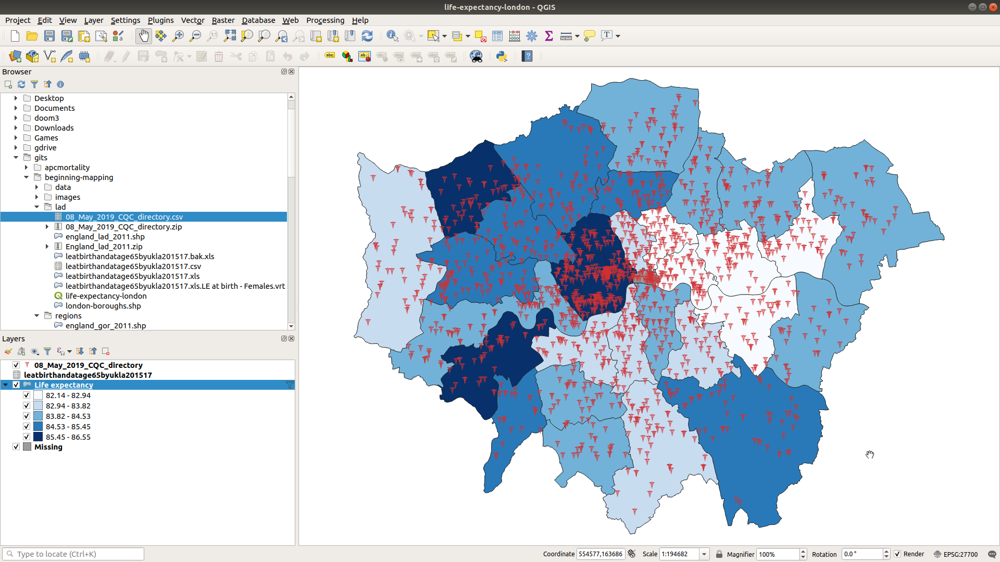


## Base map

We can optionally add a basemap to our map.
This is a layer that sits underneath the other layers with transparency and is useful to provide context for other readers of your map, particularly if they are not familiar with the area.
It is not usual (or necessary) to provide a basemap for an area the size of London; at this scale we are not ordinarily interested in street--level information and readers will generally be more familiar with larger geographies such as a city, region, or country.
It is much more common to provide a basemap for a smaller geography, such as an area within a city, because we may wish to interpret our map along with street--level information.
For this example we are going to add a basemap to London overall, and you may wish to explore adding a basemap to a smaller area as an extra exercise.

Begin by installing the `QuickMapServices` plugin by choosing the `Plugins` > `Manage and Install Plugins` menu and search for `quickmapservices`.

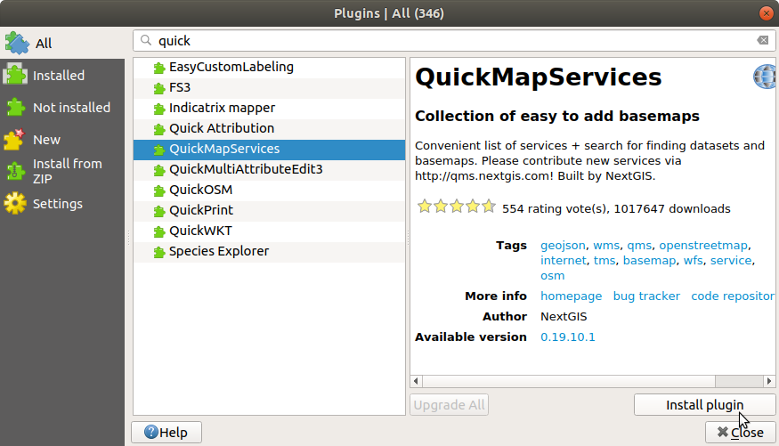

Under `Web` > `QuickMapServices` there are options for different tile providers.
I recommend an OSM basemap and especially the `OSM TF Transport Dark` can be an effective choice for basemaps, so select this.
Drag this to the top in the Layers panel, or right--click it and press `Move to Top`.
To make it transparent right--click it in the Layers panel and press `Properties` > `Transparency`.
Values around 30--40% work well, so experiment until you are happy with the result and press `Apply`.
We are not going to trim the basemap to the London administrative boundary layer, so select the `Symbology` tab and under `Blending Mode` choose `Overlay`.
Press `OK`.

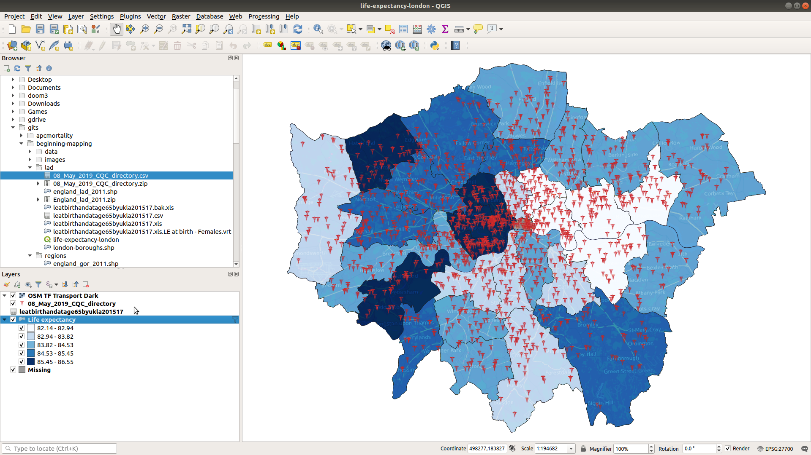

**Note:** Once you have added a basemap the 'Zoom Full' (`CTRL`/`CMD` + `Shift` + `F`) will now zoom to show the whole globe, regardless of whether you have any other area tiles loaded.
To zoom to just London (or whatever boundaries you are working with) you must now right--click the layer in the Layers panel and choose `Zoom to Layer` (at the top).


# Export the map

Now that we have our complete map we need to export it from QGIS to be able to use in reports, presentations, or web pages.
The simplest way (but also the way with least control) is to use the `Project` > `Import/Export` > `Export Map to...` options.
Images are useful for embedding in Microsoft Word documents or for use on web pages.
PDFs are very useful for sharing as a stand--alone file, and are especially useful if you do not use a basemap and can be saved as a vector file (i.e. the map will scale infinitely large with no loss of detail).
The steps for both are very similar, so let's export an image:

1. Choose `Project` > `Import/Export` > `Export Map to Image`
1. Set the extent if necessary by selecting `Calculate from Layer` > `Missing` (or `Life Expectancy`)
1. For reports (Word document, etc.) or printing choose 300dpi; for web you can leave 96dpi
1. Leave all other options as their defaults
1. Press `Save` and save to a sensible location

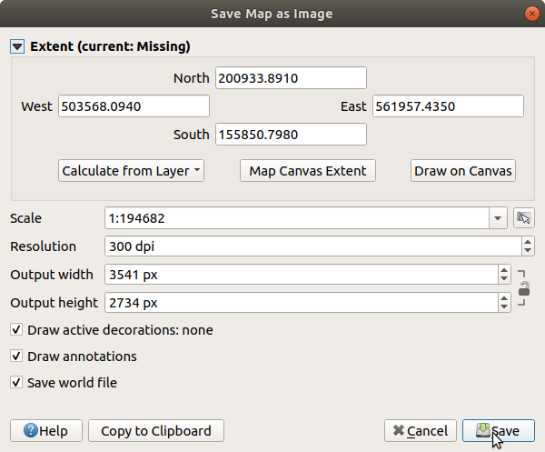

When we want more control we can use `Print Layout`.
Select `Project` > `New Print Layout` (`CTRL`/`CMD` + `P`) and enter a title.
I have called mine `a4-landscape` to reflect the dimensions of the exported image.
Begin with `Add Item` > `Add Map` and draw a rectangle across the whole page.
This should load a preview of your map.

**Note:** if the map preview does not fill the layout adequately adjust the view in the main QGIS window.
It can also be beneficial to adjust the width of the sidebar to more closely crop to the width of the map.

Now add a legend with `Add Item` > `Add Legend` and click approximately where you would like the legend to be displayed.
We do not need some of the layers and we want to label some of the items more descriptively, so:

1. Under the `Item Properties` tab > `Legend Items` untick `Auto update`
1. Click `OSM TF Transport Dark` and press remove (red `-` (minus))
1. Click `08_May_2019_CQC_directory` (or similar) and press Edit (the icon of the notepad), and change the item text to `GP surgery`
1. Click `leatbirthandatage65byukla201517` and remove

Your legend should now be much more informative.
We can also add any arbitrary text (or even html) to the figure, so let's add a title.

1. `Add Item` > `Add Label`
1. Click approximately where you would like the label to appear (you can move it later)
1. Under the sidebar > `Item Properties` tab > `Main Properties` change the 'Lorum ipsum' placeholder text to your title
1. Change this to: 'Female life expectancy by London borough, 2015-2017'
1. Under `Appearance` change the font and font size as you wish. I prefer a serif font at about size 14 for a title.

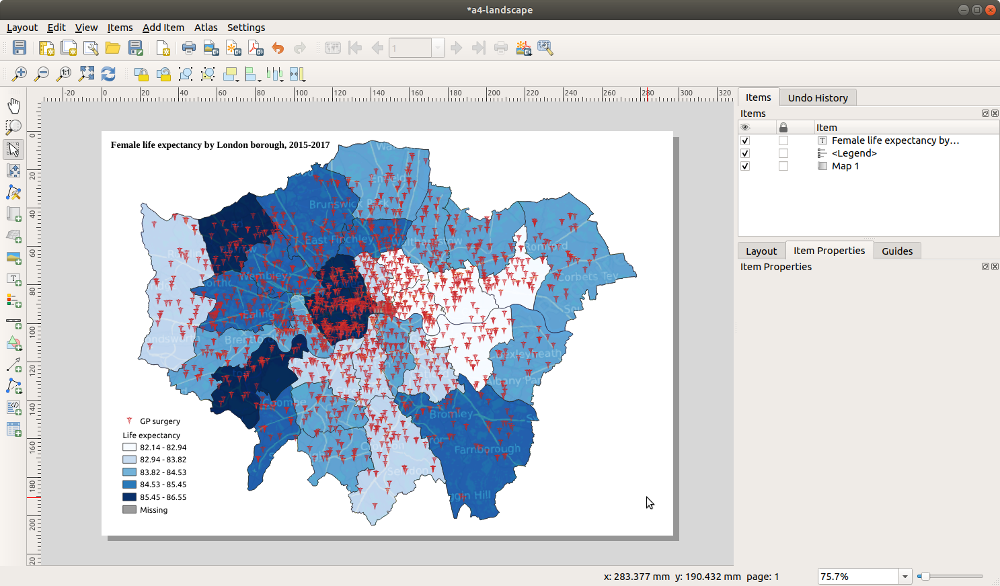

You can add other items to the map, and I suggest you spend some time testing out what you might wish to add.
A word on scale bars and compass/north arrows: you need neither.
For a map of an area like London or a country that your readers are likely to be familiar with, a scale bar is optional and often just adds clutter.
You may wish to add a scale bar for smaller geographies (perhaps a single borough within London) as this might add useful context.
Generally your maps will face north to the top so a compass/north arrow is superfluous; you should add one if your map does not face north and the implied north is not obvious (Figure \ref{house-price-3d} does not include a north arrow because this is easily recognisable).

Now to export the map.
If your map includes transparency (as ours does) we must export as a raster.
If it does not include transparency (or other non--scalable features) we can export as a vector, which is often superior.
For an elegant discussion of the differences between raster and vector see:

```html
https://vector-conversions.com/vectorizing/raster_vs_vector.html
```

For now under the Print Layout sidebar > `Layout` tab > `Export Settings` and tick `Print as raster`.
Choose 300dpi for print and 96dpi for screen use.
Now under the `Layout` menu you can choose to export as image, pdf, or svg.
Congratulations, you've completed all the exercises!


# What next?

There is only so much it's possible to learn on a one day course, so this is very much an introduction to some of the fundamental features of GIS.
Now you can think about analysing and interpreting your map, or use the map interactively to explore different areas of London.
You could answer the following questions:

- Is there a greater density of GP practices in areas with high life expectancy?
- What other factors affect GP practice density (e.g. population density)?
- Are there any outliers (high life expectancy but low density, or vice versa)?
- What other information would you like to have to assess this in more detail? Perhaps number of patients, number of complex needs patients, number of doctors, CQC rating, etc.?
- What other variables or data would you like to compare life expectancy with? Infant mortality? Obesity prevalence? Air quality? Cake consumption?[^cake] Anything else?

[^cake]: I have plotted cake consumption based on simulated data from the Adult Dental Health Survey.

If you have some time left you are welcome to use the time to:

- Explore some of the more advanced QGIS options available in the GRASS toolbox
- Try to map some of your own data for an administrative area of your choice
- Render a 3d map (hint: look in the plugins menu)
- Try to produce a cartogram (a cartogram *must* be scaled with count data; this life expectancy data is not suitable)

Feel free to ask for help.


# Where to get help

### From your instructor

The best way to contact me is often through twitter: `@philmikejones`

If you have a GIS question that is not answered on GIS StackExchange (see below), ask the question and share the link with me via twitter (preferred) or email: `philmikejones@gmail.com`

### QGIS Uncovered

Steven Bernard has produced a series of excellent tutorial videos for QGIS.
They were recorded with QGIS 2 but many of the steps and procedures are the same or very similar with QGIS 3, so this is still a very useful resource:

```html
https://www.youtube.com/playlist?list=PL7HotvlLKHCs9nD1fFUjSOsZrsnctyV2R
```

### GIS StackExchange

A community Q&A for GIS.
Always search to see if there is an answer to your question first, then ask if necessary.
Share the link with me on twitter (`@philmikejones`) if you'd like me to try to answer it.

```html
https://gis.stackexchange.com/
```


# Acknowledgements

This document contains data obtained and used under the terms of the Open Government License.

Contains National Statistics data © Crown copyright and database right [2019]
    Contains OS data © Crown copyright [and database right] (2019)

Contains Care Quality Commission data © Care Quality Commission (2019)

Uses geocoded data from `https://gridreferencefinder.com/postcodeBatchConverter/` © 2014 UK Grid Reference Finder.

Thanks to Dr. Tom Broomhead for his technical review of this document.


# References


## Spatial data

### UK

```html
https://census.ukdataservice.ac.uk/get-data/boundary-data.aspx
http://geoportal.statistics.gov.uk/
https://www.ordnancesurvey.co.uk/business-and-government/products/finder.html?Licensed%20for=OpenData%20(Free)
http://casweb.ukdataservice.ac.uk/
```

### World

```html
https://data.humdata.org/search?ext_geodata=1
http://download.geofabrik.de/
http://www.diva-gis.org/Data
https://gadm.org/data.html
https://www.naturalearthdata.com/downloads/
```

StatSilk (https://www.statsilk.com/maps/download-free-shapefile-maps) also maintain a list of up--to--date sources of shapefiles.


### Programming and interactive

```html
https://developers.google.com/maps/documentation/
https://wiki.openstreetmap.org/wiki/Overpass_API
```

If you wish to use R or python for your GIS I strongly recommend the following packages:

- `sf` (R)
- `geopandas` (python)


### EPSG codes

```html
http://spatialreference.org/ref/epsg/
```

### Projections

```html
https://thetruesize.com
```

### Geocoding

```html
https://postcodes.io/
```

### Styles

```html
http://colorbrewer2.org/
```

I'm not a designer so I found this book very helpful:

Peterson, Gretchen N. (2012) *Cartographer's Toolkit: Colors, Typography, Patterns*. PetersonGIS: Fort Collins, CO. Available from: https://amzn.to/2YsKGic


## Gallery

### Cartograms

```html
https://worldmapper.org/
```

### 3D visualisation

```html
https://philmikejones.github.io/datavis3d/
```
